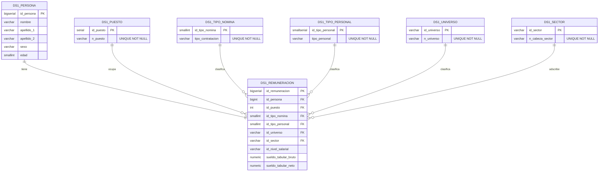

# Dataset 1 — Remuneraciones del personal de la CDMX

> Entregable de las **Etapas 1, 2 y 3** del proyecto de Bases de Datos Relacionales: documentación del dataset, limpieza y staging, y normalización hasta 4FN.
>
> **Carpeta autocontenida**: nada fuera de `/normalizacion/dataset_1/` se modifica. Las instrucciones de integración con el repo y la BD del proyecto principal están en `INTEGRATION.md`.

---

# Etapa 1 — Documentación del dataset

## 1. Resumen

El dataset contiene el **padrón de remuneraciones del personal** que labora en la administración pública del Gobierno de la Ciudad de México. Cada fila representa un servidor público, con su identidad básica (nombre, sexo, edad), su puesto, el tipo de nómina y de personal, el ente público (sector / cabeza de sector) al que está adscrito, su universo de clasificación, y el tabulador salarial bruto y neto asociado a la asignación.

Volumetría: **246,821 filas** y **16 columnas**.

## 2. Origen y autoría

- **Publicador**: Gobierno de la Ciudad de México, a través del **Portal de Datos Abiertos de la CDMX** (`datos.cdmx.gob.mx`).
- **Página oficial del dataset**: <https://datos.cdmx.gob.mx/dataset/remuneraciones-al-personal-de-la-ciudad-de-mexico/resource/7f0d7073-6861-4d8c-9ca5-17ebe3ff2388>
- **Entidad responsable de la captación**: dependencias y entidades que conforman la administración pública de la CDMX (alcaldías, secretarías, organismos descentralizados, fideicomisos), reportando hacia la dependencia que centraliza el padrón. La identificación nominal exacta del área publicadora dentro del gobierno de la CDMX queda como **pendiente de validar con el equipo** (la metadata pública del recurso en el portal no la expone de forma directa en el JSON API).

## 3. Justificación

El padrón se publica en cumplimiento de las obligaciones de **transparencia y rendición de cuentas** del gobierno de la CDMX, que exigen poner a disposición de la ciudadanía información sobre la estructura, retribución y composición del aparato público. Permite vigilancia ciudadana, análisis comparativo entre dependencias, estudios académicos sobre brecha salarial, y auditoría de la nómina pública.

## 4. Disponibilidad y acceso

- **Link al recurso CSV** (oficial): <https://datos.cdmx.gob.mx/dataset/remuneraciones-al-personal-de-la-ciudad-de-mexico/resource/7f0d7073-6861-4d8c-9ca5-17ebe3ff2388>
- **Copia local** del archivo entregado (ya recodificado a UTF-8): `data/raw/remuneraciones_da_qna_14_23.csv`. El original llegó codificado en Windows-1252; se recodificó con `iconv -f WINDOWS-1252 -t UTF-8`.
- **Licencia**: típicamente "Datos Abiertos / uso libre con atribución" en el portal CDMX. **Pendiente de validar con el equipo** la nota de licencia exacta vigente para este recurso.

## 5. Periodicidad de actualización

El portal de Datos Abiertos de la CDMX reporta el padrón con periodicidad **quincenal** (de ahí la abreviatura `qna` en el nombre del archivo). La frecuencia exacta (vigente vs histórica) es **pendiente de validar con el equipo** consultando la pestaña de metadatos del recurso.

## 6. Dimensiones

| Métrica | Valor |
|---|---|
| Filas (excluyendo encabezado) | **246,821** |
| Columnas | **16** |
| Tamaño del CSV (UTF-8) | ~26 MB |
| Encoding del CSV original | Windows-1252 (recodificado a UTF-8 para la carga) |

## 7. Diccionario de datos

Tipos sugeridos para la migración al esquema normalizado. En staging todas las columnas se cargan como `TEXT` para preservar el dato original; el casteo ocurre en `05_migration.sql`.

| Columna | Tipo (normalizado) | Significado |
|---|---|---|
| `nombre` | `varchar(80)` | Nombre(s) de pila del servidor público. |
| `apellido_1` | `varchar(60)` | Primer apellido. |
| `apellido_2` | `varchar(60)` | Segundo apellido. |
| `sexo` | `varchar(15)` | Sexo declarado: `MASCULINO`, `FEMENINO` o `NA`. |
| `edad` | `smallint` | Edad en años. Rango observado 16–60 (con un atípico). |
| `n_puesto` | `varchar(120)` | Nombre del puesto. ~1,772 valores distintos. |
| `id_tipo_nomina` | `smallint` | Identificador del tipo de nómina (1, 3, 4, 5, 6, 7, 8). |
| `tipo_contratacion` | `varchar(40)` | Modalidad de contratación; **funcionalmente determinada por** `id_tipo_nomina`. |
| `tipo_personal` | `varchar(40)` | Categoría del personal (SINDICALIZADOS, CONFIANZA, HABERES, etc.). 11 valores. |
| `id_universo` | `varchar(8)` | Clave del universo de personal. 27 distintos. |
| `n_universo` | `varchar(80)` | Nombre del universo; **funcionalmente determinado por** `id_universo`. |
| `id_sector` | `varchar(8)` | Clave del sector (alcaldía / secretaría / organismo). 73 distintos. |
| `n_cabeza_sector` | `varchar(150)` | Nombre del ente público; **funcionalmente determinado por** `id_sector`. |
| `id_nivel_salarial` | `varchar(10)` | Identificador del nivel dentro del tabulador. **No determina** el sueldo en este corte. |
| `sueldo_tabular_bruto` | `numeric(12,2)` | Sueldo tabular bruto quincenal. |
| `sueldo_tabular_neto` | `numeric(12,2)` | Sueldo tabular neto quincenal. |

## 8. Variables cuantitativas

| Variable | Min | Max | Promedio | Distintos |
|---|---:|---:|---:|---:|
| `edad` | 16 | 60 | 41.04 | 45 |
| `sueldo_tabular_bruto` | 461.00 | 111,178.00 | 13,225.32 | 858 |
| `sueldo_tabular_neto` | 859.17 | 83,013.92 | 11,796.00 | 859 |

> Nota: el conteo concentrado en edad=41 (por encima del esperado en una distribución demográfica natural) sugiere que `41` se está usando como **valor por defecto / enmascarado** en una porción importante del padrón. Se documenta en *Inconsistencias* y como pregunta para el equipo.

## 9. Variables cualitativas

`sexo`, `n_puesto`, `id_tipo_nomina`, `tipo_contratacion`, `tipo_personal`, `id_universo`, `n_universo`, `id_sector`, `n_cabeza_sector`, `id_nivel_salarial`. Ningún campo es de selección múltiple ni admite listas: todos son escalares.

## 10. Texto no estructurado

**Ningún campo es texto libre / descripción.** Lo más cercano a "texto" son los nombres (`nombre`, `apellido_1`, `apellido_2`, `n_puesto`, `n_universo`, `n_cabeza_sector`), pero todos son cadenas semi-estructuradas que actúan como etiquetas categóricas o identificadoras, no como narrativa.

## 11. Series temporales

**El dataset crudo NO contiene columnas temporales por registro.** No existe campo `fecha`, `año`, `quincena`, `corte` ni ningún otro atributo que ubique a la fila en el tiempo.

El único dato temporal disponible está **en el nombre del archivo**: `remuneraciones_da_qna_14_23`. Existen dos hipótesis razonables sobre qué codifica:

| Hipótesis | Significado | Volumetría esperada bajo esta hipótesis |
|---|---|---|
| **(H1) Corte único** — favorecida | `qna_14_23` = "quincena 14 del año 2023" (o convención análoga del portal CDMX). El archivo es **un solo corte transversal**. | ~246k filas para un padrón de la CDMX entero es coherente con una quincena. |
| (H2) Múltiples años (2014–2023) | El archivo agrega 10 años de cortes. | Implicaría millones de filas y que cada empleado apareciera ~24 veces/año × 10 años = ~240 veces. **No se observa**. |
| (H3) Múltiples quincenas (14 a 23 de un año) | El archivo agrega 10 quincenas. | Implicaría que cada empleado apareciera ~10 veces. **Tampoco se observa**: solo 1.4% de personas (`(nombre, ap1, ap2)` repetida) tiene >1 fila, y el máximo registrado son 7 apariciones, todas explicables por homonimia. |

**Conclusión basada en evidencia**: la hipótesis **H1 (corte único)** es la más consistente con la distribución de los datos. Las pocas repeticiones de nombre completo se explican mejor por homonimia (`MIGUEL ANGEL HERNANDEZ MARTINEZ` aparece 7 veces, en sectores distintos) que por repeticiones temporales del mismo individuo.

**Implicación de diseño**: como el corte temporal es **metadato del archivo** (no dato del registro), tratamos esta limitación como característica legítima del dataset. **No** introducimos columnas derivadas en staging ni en el esquema normalizado. La pregunta "¿de cuándo es este corte?" es responsabilidad del equipo y del portal de origen.

## 12. Visión estratégica

**Objetivo del análisis**: caracterizar la nómina pública de la CDMX para responder preguntas como:

- ¿Cómo se distribuye el gasto en sueldos entre sectores y universos?
- ¿Qué brecha salarial por sexo existe a igualdad de puesto / nivel?
- ¿Qué entes concentran el mayor volumen de personal sindicalizado vs. de confianza?
- ¿Qué puestos exhiben mayor dispersión de sueldo (señal de heterogeneidad / discrecionalidad)?

**Cómo se implementa**: el modelo en 4FN aísla cada dimensión (universo, sector, puesto, tipo de nómina, tipo de personal) en su propio catálogo y deja la fact `ds1_remuneracion` lista para análisis agregado. Las consultas analíticas se reducen a joins simples entre la fact y los catálogos, indexados por las claves foráneas correspondientes.

## 13. Consideraciones éticas

| Tema | Detalle |
|---|---|
| **Datos personales** | Nombre completo + sector + sueldo de cada servidor público. Aunque la publicación es legítima por transparencia, el cruce con otros datasets podría permitir reidentificación detallada (ej. dirección laboral). |
| **Anonimización parcial** | 41 filas tienen `(nombre, apellido_1, apellido_2) = (RESERVADO, RESERVADO, RESERVADO)` — sugerimos validar con el equipo la regla aplicada (probablemente personal de seguridad / áreas sensibles). |
| **Sesgo de género** | 1 fila con `sexo='NA'` (anomalía/sesgo de captura). Distribución 56.9% MASCULINO / 43.0% FEMENINO. |
| **Edad enmascarada** | La concentración anormal en edad=41 sugiere que ese valor opera como default / opt-out. Cualquier análisis demográfico debe tenerlo en cuenta. |
| **Uso responsable** | Aunque los datos son públicos, segmentaciones nominativas (ej. "todas las personas llamadas X que ganan más de Y") cruzan la línea ética del propósito de publicación. |
| **Limitación de identificador estable** | No hay CURP/RFC. Cualquier deduplicación nominativa puede generar **falsos positivos** (homonimias) y **falsos negativos** (variación de acentos / formato). |

---

# Etapa 2 — Limpieza y staging

## Documentación de scripts

| Script | Qué hace |
|---|---|
| `sql/01_staging_create.sql` | Crea el schema `ds1` y la tabla `ds1.ds1_staging_remuneraciones` con todas las columnas en `TEXT`. Incluye `staging_row_id` y `cargado_en` como metadatos técnicos (no son datos del CSV). No introduce columnas derivadas. |
| `sql/02_staging_load.sql` | Carga el CSV (UTF-8) con `COPY ... FORMAT CSV`, manejando comillas dobles para los campos con comas literales (`n_cabeza_sector`). |
| `sql/03_exploratory_analysis.sql` | 8 bloques de análisis (A–H) que responden a los puntos pedidos por la rúbrica: candidatas a PK, ausencia de temporal, estadísticas numéricas, duplicados, redundancias, distribuciones categóricas, nulos, inconsistencias. |
| `sql/04_normalized_schema.sql` | DDL del esquema en 4FN: 5 catálogos + entidad Persona + fact Remuneración. |
| `sql/05_migration.sql` | Migración del staging al modelo normalizado, con casteo de tipos y manejo de FKs. |
| `sql/06_verification.sql` | 6 verificaciones (V1–V6): conteos, cardinalidad, sumas agregadas, ausencia de huérfanas, integridad referencial, reconstrucción del staging desde el modelo. |

## Resultados del análisis exploratorio

### A. Candidatas a PK

| Columna | Distintos | ¿Candidata a PK? |
|---|---:|---|
| `nombre` | 51,710 | No (muchas repeticiones). |
| `apellido_1` | 7,863 | No. |
| `apellido_2` | 7,872 | No. |
| `(nombre, apellido_1, apellido_2)` | 243,386 | **No**: 2,788 colisiones por homonimia entre 246,821 filas. |
| `n_puesto` | 1,772 | No. |
| `id_tipo_nomina` | 7 | No. |
| `id_universo` | 27 | Sí, **PK natural del catálogo Universo**. |
| `id_sector` | 73 | Sí, **PK natural del catálogo Sector**. |
| `id_nivel_salarial` | 721 | No: aparece con múltiples sueldos. |

### B. Series temporales / rangos de fechas

No aplica: el CSV no tiene columnas temporales por registro. Documentado en sección 11 del README.

### C. Estadísticas numéricas

| Variable | Min | Max | Promedio |
|---|---:|---:|---:|
| `edad` | 16 | 60 | 41.04 |
| `sueldo_tabular_bruto` | 461.00 | 111,178.00 | 13,225.32 |
| `sueldo_tabular_neto` | 859.17 | 83,013.92 | 11,796.00 |

### D. Duplicados en categóricos

- Pares `(id_universo, n_universo)`: **27 únicos**, 1:1 perfecto.
- Pares `(id_sector, n_cabeza_sector)`: **73 únicos**, 1:1 perfecto.
- Pares `(id_tipo_nomina, tipo_contratacion)`: **7 únicos**, 1:1 perfecto.
- Combinaciones `(nombre, apellido_1, apellido_2)`: 2,788 con >1 fila (homonimias).

### E. Columnas redundantes

`n_universo`, `n_cabeza_sector` y `tipo_contratacion` son **redundantes** dentro del staging porque pueden recuperarse desde sus catálogos respectivos. La normalización 3FN las elimina de la fact.

### F. Distribución categórica (extractos)

**Sexo**:

| Valor | Filas |
|---|---:|
| MASCULINO | 140,784 |
| FEMENINO | 106,036 |
| NA | 1 |

**Tipo de personal** (top):

| Valor | Filas |
|---|---:|
| SINDICALIZADOS | 99,212 |
| HABERES | 37,200 |
| CONFIANZA | 32,171 |
| ESTABILIDAD LABORAL | 27,015 |
| BASE NO SINDICALIZADO | 21,111 |
| HONORARIOS | 14,648 |
| ESTRUCTURA | 10,949 |
| INTERINATO | 2,159 |
| LISTA DE RAYA NO SINDICALIZADO | 1,656 |
| EVENTUALES | 399 |
| CARACTER SOCIAL | 301 |

**Tipo de contratación** (mapeo 1:1 con id_tipo_nomina):

| id | tipo_contratacion |
|---|---|
| 1 | BASE |
| 3 | HONORARIOS |
| 4 | HABERES |
| 5 | LISTA DE RAYA BASE |
| 6 | CARACTER SOCIAL |
| 7 | EVENTUAL |
| 8 | PROVISIONAL |

### G. Valores nulos por columna

**Cero nulos / cero vacíos en las 16 columnas del CSV.** Es un dataset muy limpio en ese aspecto.

### H. Inconsistencias detectadas

| # | Inconsistencia | Detalle |
|---|---|---|
| H1 | `sexo='NA'` en 1 fila | Anomalía aislada; documentada en check constraint y como pregunta para el equipo. |
| H2 | Anonimización con `RESERVADO` | 41 filas con la trinidad nombre completo = `(RESERVADO, RESERVADO, RESERVADO)`. Probablemente personal de seguridad. |
| H3 | `id_nivel_salarial` no determina sueldo | 88/721 niveles tienen >1 sueldo bruto. Se conserva como atributo textual, no como FK. |
| H4 | Concentración anormal en `edad=41` | Posible valor por defecto / enmascarado. No bloquea la migración pero sesga análisis demográficos. |
| H5 | Encoding original Latin-1 | Se recodificó a UTF-8 antes de la carga; sin pérdida. |
| H6 | Comas literales dentro de campos | `n_cabeza_sector` con comas (ej. `"SECRETARIA DE EDUCACION, CIENCIA, TECNOLOGIA E INNOVACION DE LA CDMX"`) — manejadas correctamente por `FORMAT CSV` con `QUOTE '"'`. |

---

# Etapa 3 — Normalización hasta 4FN

## Resumen del modelo

7 tablas en 4FN: 5 catálogos + 1 entidad Persona + 1 fact Remuneración. Detalles, ejemplos paso a paso y prueba formal en `docs/normalization_steps.md`.

## Diagrama Entidad-Relación

- Versión renderizada: [`docs/erd.png`](docs/erd.png)
- Versión Mermaid editable: [`docs/erd.mermaid`](docs/erd.mermaid)

## Dependencias funcionales y multivaluadas

- Lista exhaustiva de DFs (aceptadas y rechazadas, con evidencia): [`docs/functional_dependencies.md`](docs/functional_dependencies.md)
- Análisis de MVDs por par de atributos y conclusión: [`docs/multivalued_dependencies.md`](docs/multivalued_dependencies.md)
- Pasos de descomposición 1FN → 2FN → 3FN → BCNF → 4FN con ejemplos reales: [`docs/normalization_steps.md`](docs/normalization_steps.md)

## Conteos esperados tras la migración

| Tabla | Filas esperadas | Razón |
|---|---:|---|
| `ds1_universo` | 27 | Distintos en el CSV. |
| `ds1_sector` | 73 | Distintos en el CSV. |
| `ds1_tipo_nomina` | 7 | Distintos en el CSV. |
| `ds1_tipo_personal` | 11 | Distintos en el CSV. |
| `ds1_puesto` | 1,772 | Distintos en el CSV. |
| `ds1_persona` | 246,821 | 1 por fila del staging (no se deduplica por homonimia, ver decisión documentada). |
| `ds1_remuneracion` | 246,821 | 1 por fila del staging (sin pérdida ni duplicación). |

La query `V1` de `06_verification.sql` confirma estos conteos. Las queries `V3` y `V6` confirman que la suma agregada de sueldos y la reconstrucción ancha del modelo coinciden exactamente con el staging.

---

# Preguntas para el equipo

Esta sección lista todas las decisiones, supuestos e interpretaciones que el equipo debe ratificar o corregir antes de la entrega final. Es deliberadamente generosa: es mejor sobreabundar en preguntas que dejar supuestos implícitos.

### Sobre el dataset y su origen

1. **Periodicidad oficial**: ¿confirma el equipo que el dataset es de actualización **quincenal** según el portal CDMX, o tiene una etiqueta distinta (mensual, trimestral, anual)?
2. **Entidad publicadora exacta**: ¿qué dependencia dentro del Gobierno de la CDMX captura y publica el padrón? (No fue posible determinarlo unívocamente desde el JSON API de `datos.cdmx.gob.mx`).
3. **Licencia de uso**: ¿el portal CDMX expone una licencia explícita aplicable a este recurso (CC BY, Open Data Commons, otra)? Lo dejamos como pendiente de validar.
4. **Rango temporal del archivo `qna_14_23`**: la evidencia favorece **corte único** (probablemente "quincena 14 del año 2023"). ¿Confirma el equipo esta interpretación o existe documentación oficial del portal que defina otra (ej. quincenas 14–23 de un año)?

### Sobre supuestos de modelado

5. **No deduplicación de Persona**: cada fila del staging genera una fila en `ds1_persona`. La justificación es que la trinidad (nombre, apellido_1, apellido_2) NO es única (2,788 colisiones) y no hay CURP/RFC. ¿El equipo prefiere **deduplicar** asumiendo que misma trinidad = misma persona, aceptando perder ~3,400 filas legítimas por homonimia? El default actual es **no deduplicar**.
6. **`id_nivel_salarial` como atributo, no FK**: 88/721 niveles tienen >1 sueldo bruto. Lo conservamos como atributo textual de la fact. ¿Hay documentación oficial del portal CDMX que defina un tabulador externo con el que pudiéramos enriquecer (vigencias, fechas) y elevarlo a catálogo?
7. **Inclusión de `sueldo_tabular_bruto`/`neto` en la fact**: derivado del punto anterior. ¿Está bien tratarlos como atributos del registro, o el equipo prefiere extraer un "tabulador snapshot" `(id_nivel_salarial, sueldo_bruto, sueldo_neto)` aceptando que tendrá duplicados controlados?
8. **Catálogo de tipo_personal con surrogate**: el CSV no trae código natural para `tipo_personal`. Generamos `id_tipo_personal SMALLSERIAL`. ¿El equipo conoce un código oficial CDMX que pudiéramos adoptar?
9. **Catálogo de puesto con surrogate**: análogo. ¿Existe un código CDMX por puesto que el CSV no trae?

### Sobre datos sospechosos / ético-técnicos

10. **Concentración en edad=41**: ¿es un valor por defecto, un error de captura, o un artefacto de truncamiento? Recomendamos al equipo confirmar con el publicador antes de hacer cualquier análisis demográfico.
11. **41 filas con `RESERVADO`**: ¿confirmamos que es la convención CDMX para personal de seguridad / inteligencia? ¿Hay que tratarlas distinto en agregaciones (excluir, marcar)?
12. **1 fila con `sexo='NA'`**: ¿se conserva tal cual, se descarta, o se imputa? El check constraint actual la acepta; podemos endurecerlo si así se prefiere.
13. **Filas con sueldo_neto > sueldo_bruto**: la query H del análisis exploratorio detecta cualquier caso (esperado: ninguno). Si aparece >0, el equipo debería decidir política (rechazar, reportar, aceptar como dato del portal).
14. **Encoding de origen**: el archivo original llegó en Windows-1252 mezclado con caracteres `Ñ` mal codificados. Se recodificó con `iconv`. ¿El equipo quiere conservar también una copia del CSV original sin recodificar como evidencia? (Por ahora la copia recodificada es la única en `data/raw/`).

### Sobre la integración con el resto del proyecto

15. **Esquema `ds1` aislado**: usamos un schema dedicado para evitar colisiones con datasets 2 y 3 y con tablas existentes del proyecto principal. ¿El equipo prefiere otra convención (prefijo, schema, base separada)?
16. **Versionado de los SQL**: los scripts no están integrados a un sistema de migraciones (Flyway/Liquibase). ¿Quieren que se conviertan a ese formato para Etapa 4, o se ejecutan manualmente en orden?
17. **Carga del CSV**: usamos `COPY` server-side. Si el servidor no tiene acceso al filesystem, los scripts pueden requerir `\COPY` cliente — confirmar la modalidad antes del entregable final.
